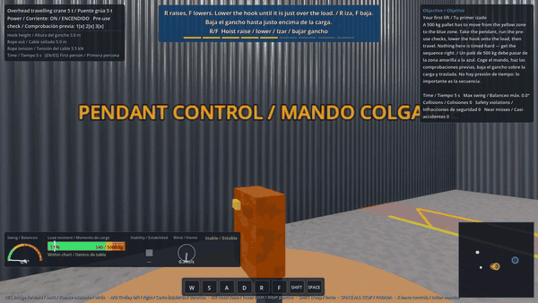
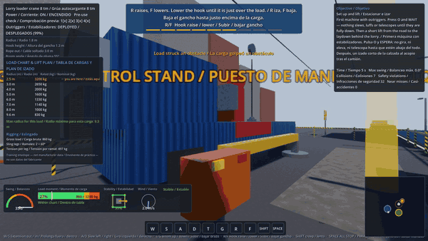
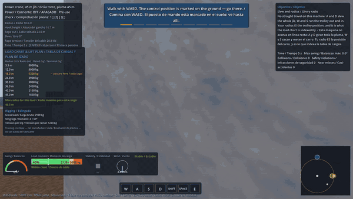
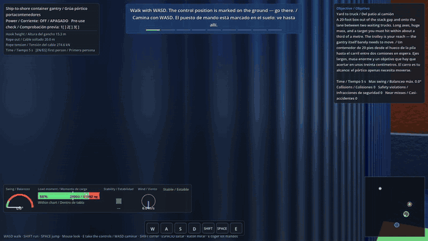

# Gelderland Operator Academy — crane & lifting simulator

A desktop crane simulator built in Godot 4.6.3: **seven machines, five sites,
eight weather conditions, twenty-one scenarios**, deterministic suspended-load
physics, real load charts and stability, and a guidance layer that always tells
you what to do next and which key does it.

<!-- PLAY_LINK -->

| | |
|:--:|:--:|
|  |  |
| **Production hall** — pendant-operated bridge crane | **City street works** — lorry loader beside live traffic |
|  |  |
| **Housing site** — tower crane, slew and radius | **Container quay** — ship-to-shore gantry |

*Clips are the built-in demo pilot (`-- --demo`) driving the machines with no
human input, through the same command path a player uses.*

> **Training aid only.** Simulator performance is not a legal certification and
> does not substitute for TCVT, VCA, a driving licence or any accredited course.
> Every load chart in this build is a **plausible training envelope, not
> manufacturer data** for any real machine, and the UI says so on screen.

---

## Machines

| Machine | Class | Site |
|---|---|---|
| Overhead travelling crane 5 t | Pendant-operated bridge crane | Production hall |
| Overhead travelling crane 16 t | Same controls, far more inertia | Production hall |
| Lorry loader crane 8 tm | Knuckle boom on a delivery lorry, outriggers | City street works |
| Tower crane, 45 m jib | Flat-top saddle jib, slew + trolley radius | Housing site |
| Mobile telescopic crane 40 t | Slew, luff, telescope, outriggers | Street / housing site |
| Rail-mounted slewing crane 25 t | Lattice boom, travels only on rails | Rail maintenance yard |
| Ship-to-shore container gantry | Twistlock spreader, centimetre tolerances | Container terminal quay |

Weather: clear, overcast, rain, fog, dusk, night, snow, storm — each changing
wind, visibility, ground grip and the lighting together, not as separate
sliders.

## What it actually teaches

Driving the crane is the easy part. The scenarios are built around the things
that are actually examined:

- **Load charts.** Capacity falls off with radius. Press **H**, find the rated
  capacity at the radius you will really be working at, and know before you lift
  whether you will finish above the 90 % pre-alarm.
- **Load moment and stability.** Slew, luff and telescope all change the radius
  at once on a mobile crane. Over a corner is markedly more stable than over the
  middle of a side.
- **Set-up.** Outriggers down before anything slews — the interlock is real and
  the machine simply will not move until they are.
- **Exclusion zones.** A live traffic lane, a public pavement, an open railway
  track, water. Some are height-banded: working *under* an overhead line is the
  job; reaching *into* it is the violation.
- **Rigging arithmetic.** Gross load, sling angle, tension per leg. Closing a
  two-leg sling from 90° to 30° doubles the tension in each leg.
- **Refusing the lift.** One scenario's correct answer is that the load does not
  move today. Taking the controls and putting them down again scores the pass.

## Controls — the same on every machine

**W/S** reach out/in · **A/D** left/right or slew · **R/F** hoist raise/lower ·
**T/G** boom up/down · **SHIFT** creep · **SPACE** ALL STOP · **O** outriggers ·
**H** load chart · **X** leave the controls

Full card: [`docs/public/CONTROLS.md`](docs/public/CONTROLS.md), the in-game
**Controls** menu, **F1** at any time, or the pause screen.

The blue strip at the top of the screen always states the next step, and the key
bar at the bottom lights up as you press.

## Run it

**With Godot 4.6.3 installed:**

```bash
godot --path src/simulator
```

**Windows portable layout used here** — the engine binary is deliberately not
committed. Put the official Godot 4.6.3 console executable at
`tools/godot/Godot_v4.6.3-stable_win64_console.exe`, then double-click:

- `START_SIMULATOR.bat` — runs the simulator (prints the control card first)
- `RUN_TESTS.bat` — runs both verification suites

Useful flags:

```bash
# jump straight into one job
godot --path src/simulator res://game/session.tscn -- --scenario=SC-403

# watch the machine drive itself through a complete lift
godot --path src/simulator res://game/session.tscn -- --demo --scenario=SC-301

# capture a screenshot for review
godot --path src/simulator res://game/session.tscn -- --scenario=SC-101 --screenshot=out --view=orbit
```

**Web build.** `godot --headless --path src/simulator --export-release "Web"`
produces a WebGL2 build in `build/web/`. It runs on the Compatibility renderer
with SSAO and glow off, half-size procedural textures and reduced particle
counts (`OS.has_feature("web")` branches in `core/weather.gd` and
`core/materials.gd`); the desktop build is untouched.

## Verification

| Suite | Checks | What it covers |
|---|---|---|
| `tests/module_tests.gd` | **22 / 22 pass** | Pure logic, no autoloads: pendulum period vs `2π√(L/g)` (0.15 % error), seeded determinism, NaN stress, catalogue integrity, per-class kinematics against hand-computed values, outrigger interlock, load-chart interpolation and planning, sling arithmetic, tipping geometry, guidance state machine |
| `tests/selftest_driver.gd` | **94 / 94 pass** | Live sessions: rebuilds the session for **every one of the 21 scenarios**, and runs the full interaction path once **per machine** — all 7 machines construct in all 5 sites under every weather preset used, every job's zones are reachable by its own machine, every control pair moves its axis through the real input map, ALL STOP brakes everything, every camera is finite, reset returns the machine home without moving the operator |

Machine-readable results: [`logs/MODULE_TEST_RESULTS.json`](logs/MODULE_TEST_RESULTS.json),
[`logs/SELFTEST_RESULTS.json`](logs/SELFTEST_RESULTS.json).

Additionally verified by hand for this release: clean headless import, clean
windowed run on Vulkan/Forward+ (RTX 3060), and **screenshot review of every
environment** — which is how the hall's unlit floor and the orbit camera
clipping through the wall were found. Neither produced a log error.

## Architecture in one paragraph

A machine is **data, not code**: one entry in `core/machine_catalog.gd` plus one
visual builder. Every machine is described with the same six axes (`travel`,
`trolley`, `slew`, `luff`, `telescope`, `hoist`) and simply omits the ones it
does not have. `MachineRig.support_point()` turns whichever axes exist into the
world position the rope hangs from — the only thing the physics needs from the
machine. Sites, scenarios and weather are data too. Nothing in the session, HUD
or scoring knows which crane it is driving, which is why going from one machine
to seven did not require rewriting the simulator.

Details: [`docs/public/ARCHITECTURE.md`](docs/public/ARCHITECTURE.md).

No binary art assets: every surface is a procedural PBR material generated at
runtime from noise into real albedo, roughness and normal maps, applied with
world-space triplanar mapping. Offline, licence-clean, and small.

## Repository map

| Path | Purpose |
|---|---|
| `src/simulator/core/` | Physics, kinematics, catalogues, load charts, rigging, stability, guidance, scoring |
| `src/simulator/environments/` | The five sites |
| `src/simulator/machines/` | Machine geometry, animated from the rig |
| `src/simulator/ui/` | Menu, HUD, pause, results, shared design kit |
| `src/simulator/scenarios/` | 21 validated scenario JSON files |
| `src/simulator/tests/` | Both verification suites |
| `docs/public/` | Controls, architecture, and what is deliberately withheld |
| `DECISIONS.md` | Append-only architecture decision record |
| `.claude/` | Agent roles, rules and skills used to build this |

## Honest limitations

- **Load charts are training envelopes, not manufacturer data.** They are shaped
  like real ones so the skill of reading one transfers. They are not any real
  crane's rated capacity.
- **Pick-ups and set-downs are at ground level.** Landing a load on an elevated
  slab needs a vertical obstacle resolver that this release does not have, so
  no scenario asks for one.
- **Scoring is a flat, published points table**, not a validated assessment. See
  [`docs/public/PUBLIC_VS_COMMERCIAL.md`](docs/public/PUBLIC_VS_COMMERCIAL.md).
- **No licence or vacancy claims.** Nothing in this build asserts that any
  employer, course, funding route or language requirement exists, because none
  of it has been verified to the standard this project requires.
- **Stability is a static training model.** It does not model dynamic effects
  from a swinging load or sudden braking, or ground bearing failure.
- Bounce constants are plausible first-pass values, not measurements.
- **The demo pilot is a demonstration controller, not an expert operator.** It
  completes a lift cleanly enough to film (SC-101: 936 points, swing 7.3° under
  an 8° limit) but still scores one ground contact on set-down. It is a
  proportional controller over the same commands a player produces, not a
  scripted animation — which is why it is subject to the same scoring.
- **No audio at all.** Motor noise, alarms and an LMI pre-alarm tone each carry
  real training information and none of it is there yet.

## What is not in this repository, and why

The simulator is complete here. The layer that would turn it into an
**assessment product** — a competency model, validated thresholds, licence
mapping, cohort reporting — is not, and
[`docs/public/PUBLIC_VS_COMMERCIAL.md`](docs/public/PUBLIC_VS_COMMERCIAL.md)
says exactly what is withheld and why.

## Licence

**PolyForm Noncommercial 1.0.0.** Read it, learn from it, use it personally,
teach yourself with it. Do not sell it or use it to run a commercial training
operation. See [`LICENSE`](LICENSE).
